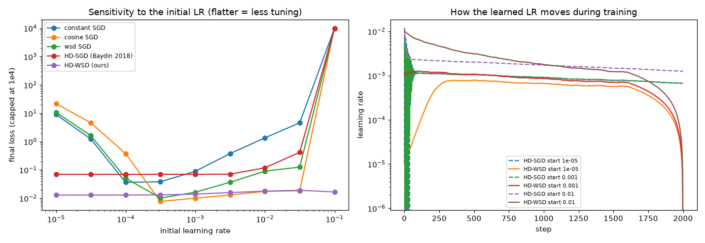
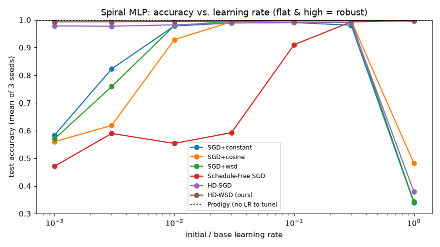
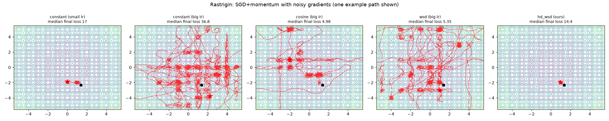

# Learning-Rate Research: Big Steps First, Then Small Steps

An open, beginner-friendly study of one question:

> **Can we let the optimizer learn its own learning rate while it trains, so it starts big, shrinks at the right time, and lands close to the minimum without dozens of tuning runs?**

The repo has three parts:

1. **Research notes**: a literature review of 28 papers, math derivations, and the open gaps.
2. **Small, readable experiments** (PyTorch, CPU-only, each runs in minutes) that use the **built-in** schedulers and optimizers wherever they exist.
3. **A prototype for what isn't built in**: hypergradient descent (`HDSGD`) and our hybrid **`HDWSD`**, where a hypergradient learns the LR level and a theory-backed cooldown handles the decay.

---

## TL;DR of the findings

- **"Decay the LR over time" is 75 years old** (Robbins & Monro 1951). It's required for SGD to converge under noise.
- **"Optimize the LR with its own gradient" also exists**: hypergradient descent (Baydin et al. 2018). Its first convergence proof appeared at ICML 2025.
- **It still isn't solved.** A 2025 benchmark found that no LR-control method is reliable across tasks. Greedy LR learning also has a known flaw: it can't see the long-term benefit of decaying (short-horizon bias).
- **Our prototype, HD-WSD, splits the job.** The hypergradient picks the *level* (a greedy signal handles that well), and theory picks the *decay* (it doesn't). In our experiments it gave almost the same result whatever LR it started from, across 3–4 orders of magnitude.
- **Honest caveats.** On a landscape with many local minima (Rastrigin) it did *worse* than a big-LR cosine schedule, because the hypergradient shrinks the LR and stops exploring. Prodigy, an existing LR-free method, was just as robust on our neural-net test.

## Results at a glance

**Experiment 3: noisy ill-conditioned quadratic.** Final loss vs. starting LR (flatter is better):



**Experiment 4: MLP on a 3-class spiral.** Test accuracy vs. starting LR, 3 seeds each:

| Method | Built-in? | Best acc (after tuning) | Median acc over LR sweep 1e-3…1 |
|---|---|---|---|
| SGD + constant | PyTorch | 0.991 | 0.978 |
| SGD + cosine | PyTorch | 0.997 | 0.929 |
| SGD + WSD | PyTorch | 0.997 | 0.979 |
| Schedule-Free SGD | pip `schedulefree` | 0.998 | 0.592 |
| HD-SGD (Baydin 2018) | prototype | 0.991 | 0.982 |
| **HD-WSD (ours)** | prototype | **0.997** | **0.995** |
| Prodigy | pip `prodigyopt` | 0.998 | (no LR to tune) |



**Experiment 2: 2-D landscapes.** Big LR + decay explores and settles, a small LR gets stuck, and HD-WSD shrinks its LR and stays local:



Full discussion: [research/05-results.md](research/05-results.md).

---

## Repo layout

```
research/
  01-literature-review.md   what exists, what's missing (gap analysis)
  02-math-notes.md          derivations: stability 2/L, noise ball, hypergradient, HD-WSD
  03-paper-summaries.md     one-paragraph summary of each of the 28 papers
  04-builtin-vs-prototype.md which methods PyTorch/pip already give you
  05-results.md             experiment results and honest discussion
lrlab/
  schedules.py              classic schedules built from torch.optim.lr_scheduler
  optimizers.py             prototypes: HDSGD, HDWSD (not built in anywhere)
experiments/
  01_builtin_schedules.py   plot every classic schedule          (~5 s)
  02_toy_landscapes.py      Rosenbrock & Rastrigin trajectories  (~4 min)
  03_hypergradient_sensitivity.py  LR robustness on a quadratic  (~1 min)
  04_mlp_benchmark.py       neural net: all methods side by side (~2 min)
scripts/download_papers.py  fetch all 28 papers from arXiv into papers/
figures/, results/          outputs of the experiments
```

## Quick start

```bash
git clone https://github.com/hammadshakeelai/gradient-descent-lr-research.git
cd gradient-descent-lr-research
python -m venv .venv
.venv/Scripts/activate          # Windows;  macOS/Linux: source .venv/bin/activate
pip install torch --index-url https://download.pytorch.org/whl/cpu
pip install -r requirements.txt

python experiments/01_builtin_schedules.py
python experiments/02_toy_landscapes.py
python experiments/03_hypergradient_sensitivity.py
python experiments/04_mlp_benchmark.py
python scripts/download_papers.py      # optional: the 28 papers (~70 MB)
```

## Using the prototype in your own training loop

```python
from lrlab import HDWSD

opt = HDWSD(model.parameters(), lr=1e-3,   # rough guess, it adapts
            momentum=0.9, total_steps=10_000, warmup_steps=500)
for x, y in loader:
    loss = loss_fn(model(x), y)
    opt.zero_grad(); loss.backward()
    opt.step(loss=loss.item())
```

## Suggested reading order for learners

1. [02-math-notes.md](research/02-math-notes.md), sections 1–2: why the LR has limits and why it must decay.
2. Run experiments 1 and 2 and look at the figures.
3. [02-math-notes.md](research/02-math-notes.md), section 3: the hypergradient, in one line of calculus.
4. Run experiments 3 and 4.
5. [01-literature-review.md](research/01-literature-review.md): where the field is and what is still open.

## Open problems (contributions welcome)

- A convergence proof for HD-WSD (stable phase + linear-cooldown last-iterate bound).
- A principled *when-to-decay* trigger.
- An exploration-aware hypergradient that doesn't shrink the LR on multi-modal landscapes.
- Tests on real benchmarks: CIFAR-10, a small GPT, AlgoPerf.

## License

Code and notes: MIT. The papers belong to their authors and are not redistributed here; `scripts/download_papers.py` fetches them from arXiv.
